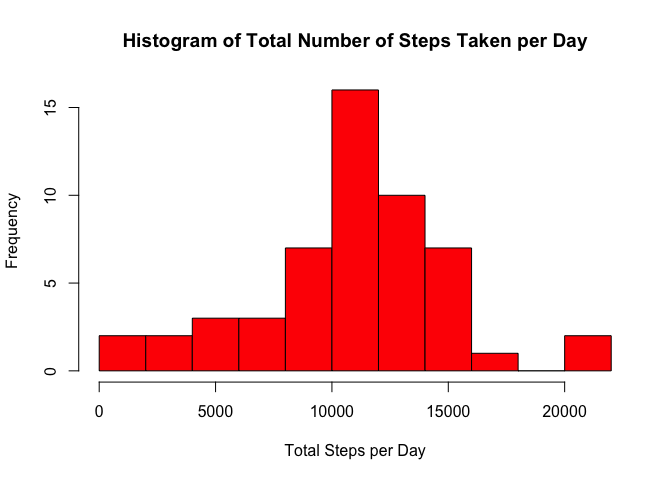
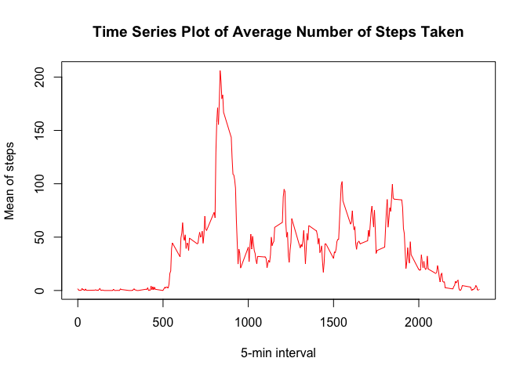
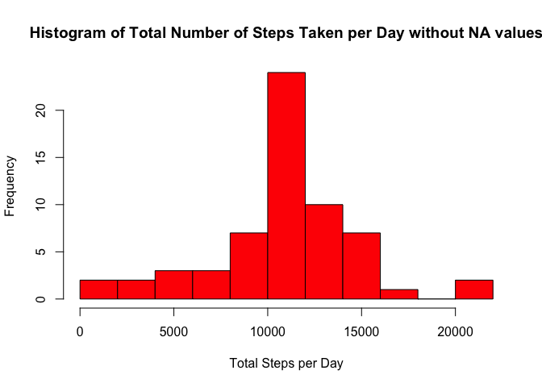
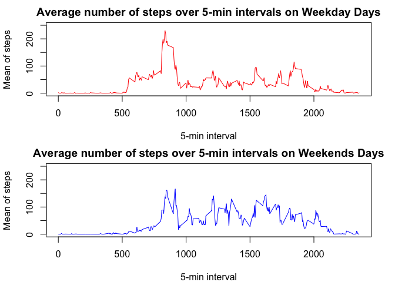

## Loading and Preprocessing Data

Here I am going to first load the data and then take a look at it to see what I will be working with.


```r
setwd("~/Desktop/R files/Reproducible Research/Week 2")
steps_data <- read.csv("activity.csv", header = TRUE)
head(steps_data)
```

```
##   steps       date interval
## 1    NA 2012-10-01        0
## 2    NA 2012-10-01        5
## 3    NA 2012-10-01       10
## 4    NA 2012-10-01       15
## 5    NA 2012-10-01       20
## 6    NA 2012-10-01       25
```

## What is the mean total number of steps taken per day?

For this part of the assignment I will be ignoring the missing values in the dataset.

Here I am first going to calculate the number of steps taken per day.


```r
total_steps <- aggregate(steps ~ date, steps_data, sum)
```

Now, I will use the summarized data of total steps per day to make a histogram of the total number of steps taken each day.


```r
hist(total_steps$steps, main = "Histogram of Total Number of Steps Taken per Day", xlab = "Total Steps per Day", ylab = "Frequency", col = "red", breaks = 15)
```

<!-- -->

From the histogram we can see that the total steps taken per day that occur the most are between 10,000 and 12,000 steps per day.

Next we will calculate the mean and the median steps per day.


```r
mn <- mean(total_steps$steps)
mn
```

```
## [1] 10766.19
```

```r
md <- median(total_steps$steps)
md
```

```
## [1] 10765
```

The mean number or steps taken per day is 1.0766189\times 10^{4}.  The median number of steps taken per day is 10765.

## What is the average daily activty pattern?

First I will need to summarize the data by 5-min intervals by taking the average of the average of the total steps taken over all days for each 5-min interval.


```r
total_steps_interval <- aggregate(steps ~ interval, steps_data, mean)
```

Next, I will make a time series plot to show the average number of steps taken, averaged across all days.


```r
with(total_steps_interval, plot(interval,steps, type = "l", ylab = "Mean of steps", xlab = "5-min interval", main = "Time Series Plot of Average Number of Steps Taken", col = "red"))
```

<!-- -->

Next, I will find the 5-min interval that contains the maximum number of steps, averaged across all the days in the dataset.


```r
max_steps <- total_steps_interval[which(total_steps_interval$steps == max(total_steps_interval$steps)),]
max_steps
```

```
##     interval    steps
## 104      835 206.1698
```

```r
int <- max_steps$interval
steps <- max_steps$steps
```

The maximum average number of steps is 206.1698113 and it occurred during the 5-min interval of 835.

## Imputing missing values

Now I want to find and replace the missing values in the dataset.  These values are coded as NA.  First, I will calculate the number of missing values in the dataset.


```r
na <- is.na(steps_data$steps)
na_num <- sum(na)
na_num
```

```
## [1] 2304
```

The total number of missing values in this data set is 2304.

Next I will replace all of the missing values in the data set with the mean for that 5-min interval.


```r
steps_data_no_na <- steps_data
na2 <- is.na(steps_data_no_na$steps)
total_steps_interval_2 <- tapply(steps_data$steps, steps_data$interval, mean, na.rm = TRUE)
steps_data_no_na$steps[na2] <- total_steps_interval_2[as.character(steps_data_no_na$interval[na2])]
```

Next we will view this new data set to be sure there are no NAs.


```r
head(steps_data_no_na)
```

```
##       steps       date interval
## 1 1.7169811 2012-10-01        0
## 2 0.3396226 2012-10-01        5
## 3 0.1320755 2012-10-01       10
## 4 0.1509434 2012-10-01       15
## 5 0.0754717 2012-10-01       20
## 6 2.0943396 2012-10-01       25
```

```r
tail(steps_data_no_na)
```

```
##           steps       date interval
## 17563 2.6037736 2012-11-30     2330
## 17564 4.6981132 2012-11-30     2335
## 17565 3.3018868 2012-11-30     2340
## 17566 0.6415094 2012-11-30     2345
## 17567 0.2264151 2012-11-30     2350
## 17568 1.0754717 2012-11-30     2355
```

```r
na3 <- is.na(steps_data_no_na$steps)
na_num2 <- sum(na3)
na_num2
```

```
## [1] 0
```

So now our data set has 0 missing values.

Next, I will create a histogram of the total steps taken each day for new data set without NAs.  First, I will calculate the number of steps taken per day.


```r
total_steps_no_na <- aggregate(steps ~ date, steps_data_no_na, sum)
```

Now, I will use the new summarized data of total steps per day to make a histogram of the total number of steps taken each day for the data with NAs replaced with the mean from that 5-min interval.


```r
hist(total_steps_no_na$steps, main = "Histogram of Total Number of Steps Taken per Day without NA values", xlab = "Total Steps per Day", ylab = "Frequency", col = "red", breaks = 15)
```

<!-- -->

From this histogram we can see that the after replacing all of the missing values with the means from the 5-min intervals, more of the data is centered in the middle of the histogram.  The total steps taken per day that occur the most are still between 10,000 and 12,000 steps per day. 

Next, I will calculate the new mean and median to see how they differ from the data that contained NAs.


```r
mn2 <- mean(total_steps_no_na$steps)
mn2
```

```
## [1] 10766.19
```

```r
md2 <- median(total_steps_no_na$steps)
md2
```

```
## [1] 10766.19
```

The new mean number or steps taken per day is 1.0766189\times 10^{4}.  The new median number of steps taken per day is 1.0766189\times 10^{4}.  The new mean did not change from the old one, but the new median is now the same as the mean.

## Are there differences in activity patterns between weekdays and weekends?

First I need to change the date column in my new dataset to be a Date format.


```r
steps_data_no_na$date <- as.Date(steps_data_no_na$date)
```

Next I will create a new factor variable in the dataset with two levels – “weekday” and “weekend” indicating whether a given date is a weekday or weekend day and add this new factor variable as a new column in the dataset.  


```r
weekday <- weekdays(steps_data_no_na$date)
day <- ifelse(weekday == "Saturday" | weekday == "Sunday", "Weekend", "Weekday")
steps_data_no_na_day <- cbind(steps_data_no_na, day)
steps_data_no_na_day$day <- as.factor(steps_data_no_na_day$day)
```

We can take a look at the dataset with the new column now.


```r
head(steps_data_no_na_day)
```

```
##       steps       date interval     day
## 1 1.7169811 2012-10-01        0 Weekday
## 2 0.3396226 2012-10-01        5 Weekday
## 3 0.1320755 2012-10-01       10 Weekday
## 4 0.1509434 2012-10-01       15 Weekday
## 5 0.0754717 2012-10-01       20 Weekday
## 6 2.0943396 2012-10-01       25 Weekday
```

Next I will make a panel plot containing a time series plot of the 5-minute interval and the average number of steps taken, averaged across all weekday days or weekend days.  To do this I will first need to summarize the data by 5-min time interval for weekdays and for weekends.


```r
total_steps_interval_wk <- aggregate(steps ~ interval, steps_data_no_na_day, mean, subset = steps_data_no_na_day$day == "Weekday")
total_steps_interval_wkend <- aggregate(steps ~ interval, steps_data_no_na_day, mean, subset = steps_data_no_na_day$day == "Weekend")
```

Now I will plot the average number of steps taken for each of the 5-minute intervals averaged across all weekday days (top plot in the panel plot) and weekend days (bottom plot in the panel plot).


```r
par(mfrow = c(2,1))
par(mar = c(4,4.1,2,2.1))
with(total_steps_interval_wk, plot(interval,steps, type = "l", ylab = "Mean of steps", xlab = "5-min interval", col = "red", main = "Average number of steps over 5-min intervals on Weekday Days", ylim = c(0,250)))
with(total_steps_interval_wkend, plot(interval,steps, type = "l", ylab = "Mean of steps", xlab = "5-min interval", col = "blue", main = "Average number of steps over 5-min intervals on Weekends Days", ylim = c(0,250)))
```

<!-- -->

We can see from the plots that the average number of steps on Weekday days spikes higher in the beginning of the day - possibly before work time, whereas the average number of steps on Weekend days is spread out throughout the day.
